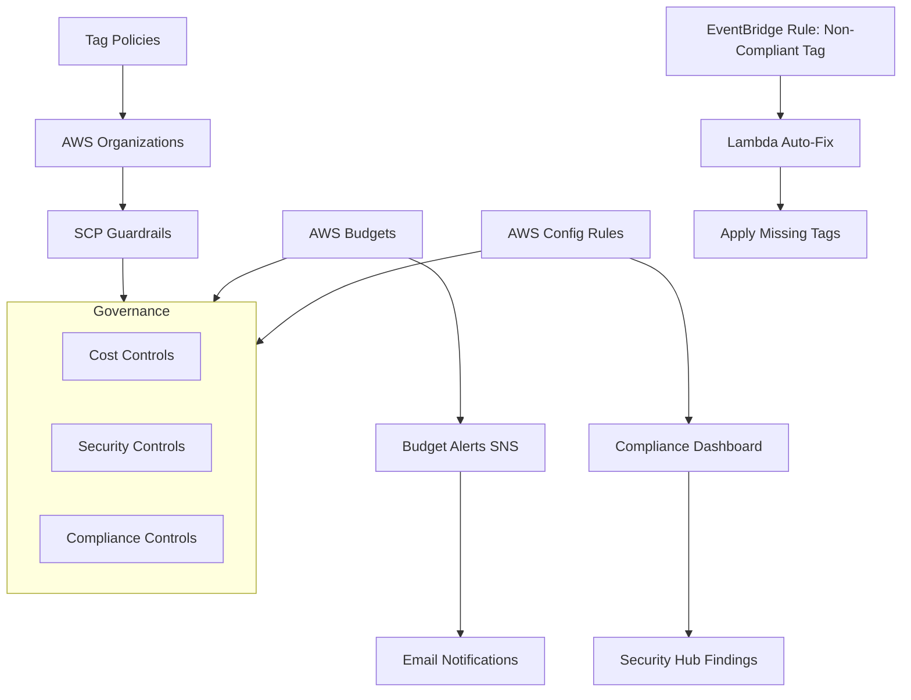

# 🧮 Day 10 – Cost Optimization & Governance Automation

Today you will implement **FinOps cost controls**, **AWS Budgets**, **SCP guardrails**, and **automated governance** to ensure the Test and Live environments remain secure, compliant, and cost-efficient.

---

## 🎯 Objectives

- Build and enforce tagging standards
- Implement cost visibility and optimization tools
- Create AWS Budgets with alerts
- Apply SCPs to restrict unsafe actions
- Automate governance with EventBridge + Lambda
- Validate compliance with AWS Config

---

## 🧱 1. Architecture Blueprint

---

## 🏷️ 2. Enforce Tagging Standards

Create a Tag Policy in AWS Organizations:

json
Copy code
{
  "tags": {
    "Environment": {
      "tag_value": {
        "enforced_for": ["ec2:instance", "s3:bucket"],
        "values": ["Test", "Live"]
      }
    },
    "Owner": {
      "tag_value": {
        "enforced_for": ["ec2:instance"],
        "values": ["CloudTeam"]
      }
    }
  }
}
Apply it to the OU where Test & Live accounts reside.

## 🛡️ 3. Apply Organization Service Control Policies (SCPs)

Block unapproved regions:
json
Copy code
{
  "Version": "2012-10-17",
  "Statement": [
    {
      "Effect": "Deny",
      "Action": "*",
      "Resource": "*",
      "Condition": {
        "StringNotEquals": {
          "aws:RequestedRegion": ["us-east-1", "us-east-2"]
        }
      }
    }
  ]
}
Block creation of untagged resources:
json
Copy code
{
  "Version": "2012-10-17",
  "Statement": [
    {
      "Effect": "Deny",
      "Action": "*",
      "Resource": "*",
      "Condition": {
        "Null": {
          "aws:RequestTag/Environment": "true"
        }
      }
    }
  ]
}

## 💰 4. Configure AWS Budgets

Create a monthly budget:

aws budgets create-budget \
  --account-id <ACCOUNT_ID> \
  --budget '{
      "BudgetName": "Monthly-Lab-Budget",
      "BudgetLimit": {"Amount": "25", "Unit": "USD"},
      "TimeUnit": "MONTHLY",
      "BudgetType": "COST"
  }'
Add SNS notifications:

aws budgets create-notification \
  --account-id <ACCOUNT_ID> \
  --budget-name "Monthly-Lab-Budget" \
  --notification '{
      "NotificationType": "ACTUAL",
      "ComparisonOperator": "GREATER_THAN",
      "Threshold": 80
  }' \
  --subscribers '[
      {"SubscriptionType": "SNS", "Address": "arn:aws:sns:us-east-1:<ACCOUNT_ID>:BudgetAlerts"}
  ]'
🔧 5. Auto-Remediation for Missing Tags
EventBridge Rule
json
Copy code
{
  "source": ["aws.ec2"],
  "detail-type": ["AWS API Call via CloudTrail"],
  "detail": {
    "eventName": ["RunInstances"]
  }
}
Lambda Auto-Fixer (Python)
python
Copy code
import boto3

def lambda_handler(event, context):
    ec2 = boto3.client('ec2')
    instance_id = event['detail']['responseElements']['instancesSet']['items'][0]['instanceId']
    ec2.create_tags(
        Resources=[instance_id],
        Tags=[{"Key": "Environment", "Value": "Test"}]
    )

## 📊 6. Validate Governance

Run AWS Config:

aws configservice describe-compliance-by-config-rule
Check Security Hub:

aws securityhub get-findings \
  --filters '{"ComplianceStatus": ["NON_COMPLIANT"]}'

## 🏁 Summary

By completing Day 10, you have:

Implemented FinOps budget controls

Enforced mandatory tagging

Applied SCP guardrails

Automated tag remediation

Validated compliance with Config & Security Hub

Your AWS environments are now fully governed, cost-efficient, and secure.
