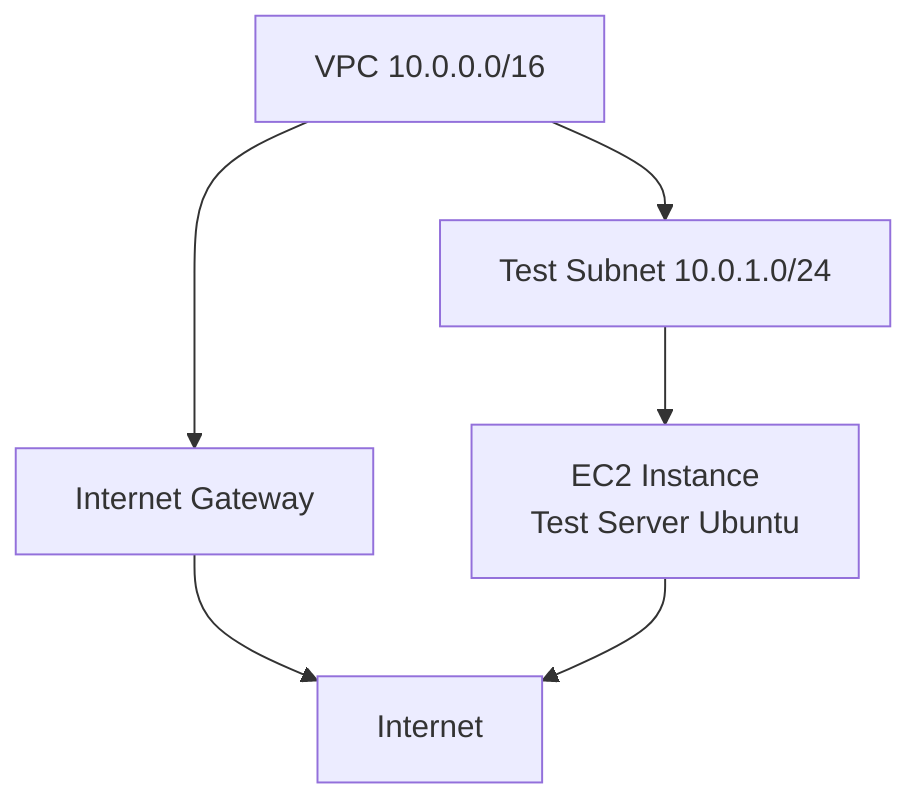

# ⚙️ Day 2 – Deploying the Test Environment (AWS EC2 + VPC)

## 🎯 Objective
Build a **secure and isolated Test network** on AWS using VPC, subnets, route tables, and EC2 instances — laying the foundation for our production (Live) environment.

---

## 🧱 1. Architecture Blueprint

## 🔒 2. Create the VPC

aws ec2 create-vpc \
  --cidr-block 10.0.0.0/16 \
  --tag-specifications 'ResourceType=vpc,Tags=[{Key=Name,Value=SecureTestVPC}]'
✅ Note the VPC ID returned in the output — you’ll reuse it below.

## 🌐 3. Create a Public Subnet
bash
Copy code
aws ec2 create-subnet \
  --vpc-id <vpc-id> \
  --cidr-block 10.0.1.0/24 \
  --availability-zone us-east-1a \
  --tag-specifications 'ResourceType=subnet,Tags=[{Key=Name,Value=TestSubnet}]'

## 🚪 4. Internet Gateway + Routing

aws ec2 create-internet-gateway
aws ec2 attach-internet-gateway --vpc-id <vpc-id> --internet-gateway-id <igw-id>

aws ec2 create-route-table --vpc-id <vpc-id>
aws ec2 create-route \
  --route-table-id <rtb-id> \
  --destination-cidr-block 0.0.0.0/0 \
  --gateway-id <igw-id>

aws ec2 associate-route-table \
  --subnet-id <subnet-id> \
  --route-table-id <rtb-id>
✅ This gives your Test subnet controlled outbound Internet access.

## 🧱 5. Create a Security Group (Restrict SSH Access)

aws ec2 create-security-group \
  --group-name TestSG \
  --description "SG for test environment" \
  --vpc-id <vpc-id>

aws ec2 authorize-security-group-ingress \
  --group-id <sg-id> \
  --protocol tcp \
  --port 22 \
  --cidr <your-ip>/32
Only your admin IP should have SSH access.

No inbound HTTP or RDP yet — keep it minimal.

## 💻 6. Launch a Test EC2 Instance

aws ec2 run-instances \
  --image-id ami-0c02fb55956c7d316 \
  --count 1 \
  --instance-type t3.micro \
  --key-name SecureKey \
  --subnet-id <subnet-id> \
  --security-group-ids <sg-id> \
  --tag-specifications 'ResourceType=instance,Tags=[{Key=Name,Value=TestServer}]'
Once running, fetch the Public IP:

aws ec2 describe-instances --instance-ids <instance-id> --query "Reservations[*].Instances[*].PublicIpAddress" --output text

## 🧪 7. Validate Connectivity
SSH into your instance:

ssh -i SecureKey.pem ubuntu@<public-ip>
Update and install NGINX for quick validation:

sudo apt update && sudo apt install -y nginx
curl http://localhost
✅ Expected result: “Welcome to nginx!” page.

## 🧰 8. Optional Teardown (Clean Exit)

aws ec2 terminate-instances --instance-ids <id>
aws ec2 delete-security-group --group-id <id>
aws ec2 delete-subnet --subnet-id <id>
aws ec2 delete-vpc --vpc-id <id>

## 📋 9. Validation Checklist

Control	Implemented	Notes
✅ VPC	Yes	10.0.0.0/16
✅ Subnet	Yes	10.0.1.0/24
✅ Security Group	Yes	SSH restricted
✅ Routing	Yes	Internet via IGW
✅ Logging	Pending	Add in Day 5 (Monitoring)

## 🧾 Day 2 Summary

✔ Created a secure Test Environment VPC
✔ Deployed EC2 instance with least privilege access
✔ Validated Internet and SSH connectivity
✔ Prepared foundation for Live (Production) environment

## 🔖 Next Step
Proceed to Day 3 – Building the Live (Production) Environment + Terraform Automation
