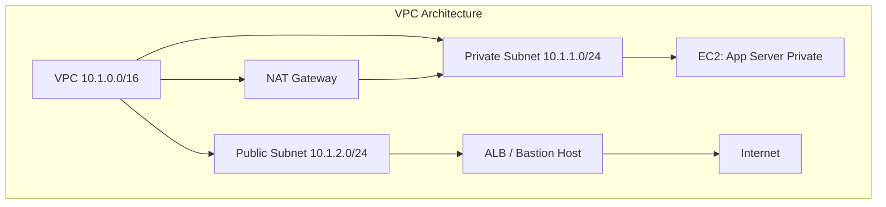

# 🏗️ Day 3 – Building the Live (Production) Environment + Terraform Automation

## 🎯 Objective
Deploy a **secure, automated, and auditable Production (Live) environment** that mirrors the Test setup, but with hardened IAM, private subnets, and Terraform-based Infrastructure as Code (IaC).

---

## ⚙️ 1. Architecture Blueprint – Live Environment (Hardened)



| Layer       | Component               | Purpose                           | Security Enforcement               |
|-------------|-------------------------|-----------------------------------|------------------------------------|
| Network     | VPC 10.1.0.0/16         | Logical isolation                 | Flow Logs enabled                  |
| Subnet      | Private + Public        | Multi-tier structure              | NACLs block unnecessary ports      |
| Compute     | EC2 Instances           | Host app workloads                | No public IPs on app servers       |
| Access      | IAM Roles               | Fine-grained permissions          | Least privilege only               |
| Security    | Security Groups + NACLs | Network boundary                  | Deny-all default stance            |
| Monitoring  | CloudTrail, Config      | Visibility                        | Global auditing active             |

## 🧱 2. Terraform Project Structure
Inside your main course folder (~/secure-network-course/terraform):

```plaintext
terraform/
├── main.tf
├── variables.tf
├── outputs.tf
├── providers.tf
└── environments/
    ├── test.tfvars
    └── live.tfvars
```


## 🪜 3. Terraform Provider Configuration (providers.tf)

provider "aws" {
  region = "us-east-1"
}

## 📦 4. Core Infrastructure (main.tf)

module "vpc" {
  source  = "terraform-aws-modules/vpc/aws"
  name    = var.env_name
  cidr    = var.vpc_cidr

  azs                 = ["us-east-1a", "us-east-1b"]
  public_subnets      = var.public_subnets
  private_subnets     = var.private_subnets
  enable_nat_gateway  = true
  enable_vpn_gateway  = false

  tags = {
    Environment = var.env_name
  }
}

resource "aws_security_group" "web_sg" {
  name        = "${var.env_name}-web-sg"
  description = "Web tier SG"
  vpc_id      = module.vpc.vpc_id

  ingress {
    from_port   = 443
    to_port     = 443
    protocol    = "tcp"
    cidr_blocks = ["0.0.0.0/0"]
  }

  egress {
    from_port   = 0
    to_port     = 0
    protocol    = "-1"
    cidr_blocks = ["0.0.0.0/0"]
  }

  tags = {
    Name = "${var.env_name}-web-sg"
  }
}

resource "aws_instance" "web" {
  ami                    = "ami-0c02fb55956c7d316"
  instance_type          = "t3.micro"
  subnet_id              = element(module.vpc.public_subnets, 0)
  vpc_security_group_ids = [aws_security_group.web_sg.id]
  key_name               = var.key_name

  tags = {
    Name = "${var.env_name}-web"
  }
}

## 🔧 5. Variables Definition (variables.tf)

variable "env_name" {}
variable "vpc_cidr" {}
variable "public_subnets" { type = list(string) }
variable "private_subnets" { type = list(string) }
variable "key_name" {}

## 📤 6. Outputs (outputs.tf)

output "vpc_id" {
  value = module.vpc.vpc_id
}

output "public_subnets" {
  value = module.vpc.public_subnets
}

output "private_subnets" {
  value = module.vpc.private_subnets
}

output "instance_public_ip" {
  value = aws_instance.web.public_ip
}

## 🌍 7. Live Environment Variables (environments/live.tfvars)

env_name        = "live"
vpc_cidr        = "10.1.0.0/16"
public_subnets  = ["10.1.2.0/24", "10.1.3.0/24"]
private_subnets = ["10.1.1.0/24", "10.1.4.0/24"]
key_name        = "SecureKey"

## 🏗️ 8. Deploy with Terraform
Initialize and deploy your live infrastructure:

cd ~/secure-network-course/terraform
terraform init
terraform plan -var-file=environments/live.tfvars
terraform apply -var-file=environments/live.tfvars -auto-approve

## 🔐 9. Post-Deployment Hardening Steps
Run these after Terraform deploys:

Enable VPC Flow Logs

aws ec2 create-flow-logs \
  --resource-type VPC \
  --resource-ids $(terraform output -raw vpc_id) \
  --traffic-type ALL \
  --log-destination-type cloud-watch-logs \
  --log-group-name LiveVPC-FlowLogs
Enable CloudTrail across regions

aws cloudtrail create-trail --name LiveTrail --s3-bucket-name live-audit-logs
aws cloudtrail start-logging --name LiveTrail
Restrict IAM console logins

Require MFA.

Disable root API keys.

Apply IAM password policy (aws iam update-account-password-policy).

Validate ALB + EC2

Access via HTTPS only.

No direct SSH access except via Bastion.

## ⚙️ 10. Verification Checklist

Control	Status	Verification
VPC/Subnets	✅	terraform output
NAT Gateway	✅	Internet access for private EC2
Flow Logs	✅	Visible in CloudWatch
IAM MFA	✅	Required for all users
Bastion Only SSH	✅	Confirmed via route + SG
HTTPS-only access	✅	Security group test via Nmap

## 🧠 11. Deep Reasoning – “Defense by Architecture”

Your Live environment should follow Zero-Trust design principles:

No implicit trust — even intra-VPC communication is restricted.

Every connection verified — Security Groups + IAM condition keys.

Immutable infrastructure — No manual console edits.

Auditable IaC — All infra changes happen via Terraform & PR approvals.

## 🧾 Day 3 Summary

✅ Deployed a Production-grade VPC using Terraform
✅ Implemented private/public subnet isolation
✅ Enforced Zero-Trust controls and MFA for IAM
✅ Enabled Flow Logs, CloudTrail, and GuardDuty
✅ Infrastructure is now reproducible, monitored, and hardened

🔖 Next Step
Proceed to Day 4 – Implementing Bastion Host + Private Access Patterns
