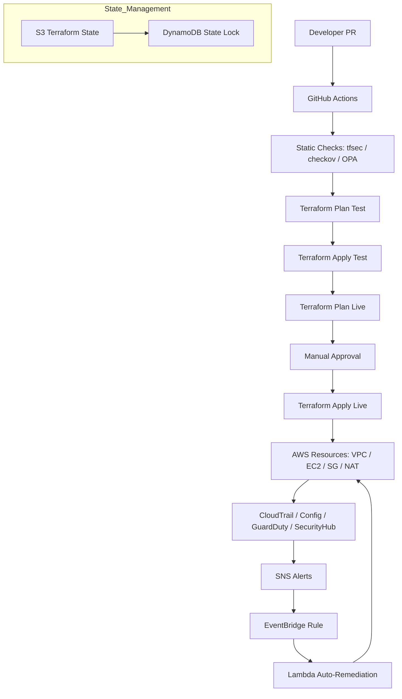

# ⚙️ Day 6 – DevSecOps, Automated Remediation & Promotion (Test → Live)

## 🎯 Objective
Wire security into the delivery pipeline: static checks (IaC), signed plans, change approvals, auto-remediation, and safe promotion from **Test → Live** with rollbacks.

---

## 🧱 1) Reference Architecture (People + Pipeline + Cloud)
- **GitHub Actions** runs IaC checks, plans, and gated applies.
- **S3 + DynamoDB** backend for Terraform state + locking.
- **OPA/Conftest + tfsec + Checkov** enforce policies.
- **Security Hub / GuardDuty** feed alerts → **SNS**.
- **EventBridge + SSM Automation / Lambda** remediate known issues (e.g., public S3).
- **Two stages**: `test` auto-apply on merge; `live` requires approval.

---

## 🧱 DevSecOps Pipeline Diagram

## 🗃️ 2) Terraform Remote State Backend
Create `~/secure-network-course/terraform/backend.tf`:

terraform {
  backend "s3" {
    bucket         = "secure-net-tfstate"
    key            = "env/${ENV}/terraform.tfstate"
    region         = "us-east-1"
    dynamodb_table = "secure-net-tf-locks"
    encrypt        = true
  }
}
Create once per account:

aws s3api create-bucket --bucket secure-net-tfstate --region us-east-1
aws dynamodb create-table --table-name secure-net-tf-locks \
  --attribute-definitions AttributeName=LockID,AttributeType=S \
  --key-schema AttributeName=LockID,KeyType=HASH \
  --billing-mode PAY_PER_REQUEST
Initialize for test then live:

cd ~/secure-network-course/terraform
ENV=test terraform init
terraform workspace new test || true
terraform workspace select test

ENV=live terraform init
terraform workspace new live || true
terraform workspace select live

## 🧪 3) Static Security Gates (Local & CI)
Install tools:

pipx install checkov
curl -s https://raw.githubusercontent.com/aquasecurity/tfsec/master/scripts/install_linux.sh | bash
Quick run:

cd ~/secure-network-course/terraform
tfsec .
checkov -d .
Optional OPA policy example (policy/deny-public-sg.rego):

rego
Copy code
package terraform.security

deny[msg] {
  input.resource.aws_security_group[sg]
  some r
  sg.ingress[r].cidr_blocks[_] == "0.0.0.0/0"
  sg.ingress[r].from_port == 22
  msg := sprintf("No public SSH allowed on %s", [sg.name])
}
Run with Conftest:

conftest test .

## 🔁 4) GitHub Actions – Secure CI/CD
Create ~/secure-network-course/.github/workflows/deploy.yml:

name: Secure IaC Pipeline
on:
  pull_request:
    branches: [ main ]
  push:
    branches: [ main ]

jobs:
  validate-test:
    name: Validate & Plan (test)
    runs-on: ubuntu-latest
    steps:
      - uses: actions/checkout@v4
      - uses: hashicorp/setup-terraform@v3
      - name: Tools
        run: |
          pipx install checkov
          curl -s https://raw.githubusercontent.com/aquasecurity/tfsec/master/scripts/install_linux.sh | bash
      - name: tfsec
        run: tfsec terraform
      - name: checkov
        run: checkov -d terraform
      - name: Terraform Init (test)
        working-directory: terraform
        env: { ENV: test }
        run: terraform init -backend-config="key=env/test/terraform.tfstate"
      - name: Terraform Plan (test)
        working-directory: terraform
        env: { ENV: test }
        run: terraform plan -var-file=environments/test.tfvars -out plan-test.tfplan
      - name: Upload Plan
        uses: actions/upload-artifact@v4
        with: { name: plan-test, path: terraform/plan-test.tfplan }

  apply-test:
    name: Apply (test on push to main)
    needs: validate-test
    if: github.ref == 'refs/heads/main'
    runs-on: ubuntu-latest
    steps:
      - uses: actions/checkout@v4
      - uses: hashicorp/setup-terraform@v3
      - name: Terraform Init (test)
        working-directory: terraform
        env: { ENV: test }
        run: terraform init -backend-config="key=env/test/terraform.tfstate"
      - name: Terraform Apply (test)
        working-directory: terraform
        env: { ENV: test }
        run: terraform apply -auto-approve -var-file=environments/test.tfvars

  plan-live:
    name: Validate & Plan (live)
    needs: apply-test
    runs-on: ubuntu-latest
    steps:
      - uses: actions/checkout@v4
      - uses: hashicorp/setup-terraform@v3
      - name: Tools
        run: |
          pipx install checkov
          curl -s https://raw.githubusercontent.com/aquasecurity/tfsec/master/scripts/install_linux.sh | bash
      - name: tfsec
        run: tfsec terraform
      - name: checkov
        run: checkov -d terraform
      - name: Terraform Init (live)
        working-directory: terraform
        env: { ENV: live }
        run: terraform init -backend-config="key=env/live/terraform.tfstate"
      - name: Terraform Plan (live)
        working-directory: terraform
        env: { ENV: live }
        run: terraform plan -var-file=environments/live.tfvars -out plan-live.tfplan
      - name: Upload Plan
        uses: actions/upload-artifact@v4
        with: { name: plan-live, path: terraform/plan-live.tfplan }

  manual-approve-and-apply-live:
    name: Manual Approval & Apply (live)
    needs: plan-live
    runs-on: ubuntu-latest
    environment:
      name: production
      url: https://aws.amazon.com
    steps:
      - uses: actions/checkout@v4
      - uses: hashicorp/setup-terraform@v3
      - name: Terraform Init (live)
        working-directory: terraform
        env: { ENV: live }
        run: terraform init -backend-config="key=env/live/terraform.tfstate"
      - name: Download Plan
        uses: actions/download-artifact@v4
        with: { name: plan-live, path: terraform }
      - name: Apply (live)
        working-directory: terraform
        env: { ENV: live }
        run: terraform apply -auto-approve plan-live.tfplan
Use GitHub Environments → production to require approvers + secrets.

## 🛠️ 5) Auto-Remediation Patterns
a) Public S3 Bucket Auto-Close (EventBridge + Lambda)
Create ~/secure-network-course/terraform/remediation.tf:

resource "aws_iam_role" "rem_lambda_role" {
  name = "remediate-public-s3-role"
  assume_role_policy = jsonencode({
    Version = "2012-10-17",
    Statement = [{ Effect="Allow", Principal={Service="lambda.amazonaws.com"}, Action="sts:AssumeRole"}]
  })
}

resource "aws_iam_role_policy" "rem_lambda_policy" {
  name = "remediate-public-s3-policy"
  role = aws_iam_role.rem_lambda_role.id
  policy = jsonencode({
    Version = "2012-10-17",
    Statement = [
      { Effect="Allow", Action=["s3:PutBucketAcl","s3:PutPublicAccessBlock"], Resource="*" },
      { Effect="Allow", Action=["logs:CreateLogGroup","logs:CreateLogStream","logs:PutLogEvents"], Resource="*" }
    ]
  })
}

resource "aws_lambda_function" "rem_s3" {
  function_name = "remediate_public_s3"
  role          = aws_iam_role.rem_lambda_role.arn
  runtime       = "python3.12"
  handler       = "index.handler"
  filename      = "lambda/rem_s3.zip"
}

resource "aws_cloudwatch_event_rule" "s3_public_acl" {
  name        = "detect-public-s3"
  description = "Remediate public S3 ACLs"
  event_pattern = jsonencode({
    source: ["aws.s3"],
    "detail-type": ["AWS API Call via CloudTrail"],
    detail: { eventName: ["PutBucketAcl","PutBucketPolicy"] }
  })
}

resource "aws_cloudwatch_event_target" "s3_public_acl_target" {
  rule      = aws_cloudwatch_event_rule.s3_public_acl.name
  target_id = "lambda"
  arn       = aws_lambda_function.rem_s3.arn
}

resource "aws_lambda_permission" "allow_events" {
  statement_id  = "AllowExecutionFromCloudWatch"
  action        = "lambda:InvokeFunction"
  function_name = aws_lambda_function.rem_s3.function_name
  principal     = "events.amazonaws.com"
  source_arn    = aws_cloudwatch_event_rule.s3_public_acl.arn
}
Lambda code (create folder terraform/lambda/index.py and zip it):

python
Copy code
import json, boto3
s3 = boto3.client('s3')

def handler(event, context):
    detail = event.get('detail', {})
    bucket = detail.get('requestParameters', {}).get('bucketName')
    if not bucket: return {"status":"no-bucket"}
    # Block public access + strip public ACL quickly
    s3.put_public_access_block(
        Bucket=bucket,
        PublicAccessBlockConfiguration={
            'BlockPublicAcls': True,
            'IgnorePublicAcls': True,
            'BlockPublicPolicy': True,
            'RestrictPublicBuckets': True
        }
    )
    s3.put_bucket_acl(Bucket=bucket, ACL='private')
    return {"status":"remediated", "bucket": bucket}
Zip & apply:

cd ~/secure-network-course/terraform
mkdir -p lambda
nano lambda/index.py   # paste code above
zip -j lambda/rem_s3.zip lambda/index.py
terraform apply -var-file=environments/live.tfvars -auto-approve

## 🧯 6) Rollback Strategy
Terraform: terraform destroy -target=<resource> for surgical rollback; or revert commit → pipeline reapplies previous state.

Blue/Green for app tiers: add ALB target groups per version; switch via weighted listener rule.

State backups: S3 versioning keeps tfstate history.

## ✅ 7) Promotion Flow (You’ll Practice)
PR → pipeline runs tfsec/checkov + plan (test).

Merge → apply (test).

plan (live) artifact is produced.

Human approval in production environment.

apply (live) executes with recorded change set.

## 🔍 8) Evidence & Audit
Store plan files as artifacts (immutable).

Enable required reviewers for production.

Capture CloudTrail for IAM/Terraform API calls.

Security Hub finding reductions are your KPI.

## 🧾 Day 6 Summary
✅ Remote state + locking
✅ Static policy gates (tfsec / Checkov / OPA)
✅ Two-stage pipeline with manual prod approval
✅ EventBridge + Lambda auto-remediation
✅ Rollback patterns + audit evidence

## 🔖 Next
(Optional) Day 7 – Data Layer Security (RDS/Aurora, KMS, Parameter Store/Secrets Manager, TLS, rotation)
