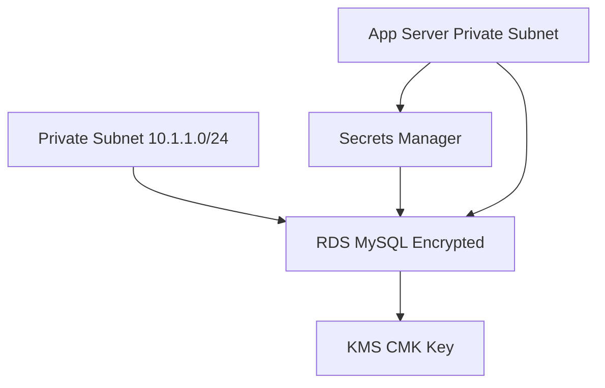

# 🔐 Day 7 – Data Layer Security (RDS / KMS / Secrets Manager / TLS)

## 🎯 Objective
Implement a secure data layer with:
- Encrypted RDS (Aurora or MySQL)
- Secrets Manager for credentials
- KMS for key management
- Parameter Store for non-secrets
- Network hardening (Private subnets + SG rules)

---

## 🧱 1. Architecture Blueprint

| Layer       | Component          | Security Control                  |
|-------------|--------------------|-----------------------------------|
| Data Store  | RDS Instance       | Storage & Transport Encryption    |
| Keys        | KMS CMK            | Automatic rotation + auditing     |
| Credentials | Secrets Manager    | Rotated every 30 days            |
| Network     | Private Subnet only| No public endpoint               |
| Access      | IAM roles          | Least privilege policy           |

## ⚙️ 2. Terraform – RDS + KMS Module

Create ~/secure-network-course/terraform/data.tf:

resource "aws_kms_key" "rds_key" {
  description = "Key for RDS encryption"
  deletion_window_in_days = 10
  enable_key_rotation = true
  tags = { Name = "${var.env_name}-rds-key" }
}

resource "aws_db_subnet_group" "rds_subnet_group" {
  name  = "${var.env_name}-rds-subnet-group"
  subnet_ids = module.vpc.private_subnets
  tags = { Name = "${var.env_name}-rds-subnet" }
}

resource "aws_security_group" "rds_sg" {
  name  = "${var.env_name}-rds-sg"
  description = "Allow MySQL from app tier"
  vpc_id = module.vpc.vpc_id

  ingress {
    from_port    = 3306
    to_port      = 3306
    protocol    = "tcp"
    security_groups = [aws_security_group.private_sg.id]
  }

  egress {
    from_port = 0
    to_port  = 0
    protocol = "-1"
    cidr_blocks = ["0.0.0.0/0"]
  }

  tags = { Name = "${var.env_name}-rds-sg" }
}

resource "aws_db_instance" "rds" {
  identifier             = "${var.env_name}-db"
  engine                = "mysql"
  engine_version        = "8.0"
  instance_class        = "db.t3.micro"
  allocated_storage    = 20
  storage_encrypted    = true
  kms_key_id           = aws_kms_key.rds_key.arn
  username             = "admin"
  password             = random_password.db.result
  db_subnet_group_name  = aws_db_subnet_group.rds_subnet_group.name
  vpc_security_group_ids = [aws_security_group.rds_sg.id]
  skip_final_snapshot    = true
  multi_az             = false
  publicly_accessible    = false
  backup_retention_period = 7
  deletion_protection    = true
  storage_type          = "gp3"

  tags = { Name = "${var.env_name}-rds" }
}

resource "random_password" "db" {
  length = 16
  special = true
}

## 🔐 3. Store Credentials Securely
Add to data.tf:

resource "aws_secretsmanager_secret" "db_secret" {
  name = "${var.env_name}-db-credentials"
}

resource "aws_secretsmanager_secret_version" "db_secret_version" {
  secret_id    = aws_secretsmanager_secret.db_secret.id
  secret_string = jsonencode({
    username = "admin"
    password = random_password.db.result
    host    = aws_db_instance.rds.address
    port    = 3306
  })
}
To rotate automatically:

aws secretsmanager rotate-secret --secret-id <secret_arn> --rotation-lambda-arn <lambda_arn>

## 🧩 4. Application Access via IAM Role

Allow only app servers to read secret:

resource "aws_iam_policy" "app_secret_access" {
  name = "AllowAppSecretAccess"
  policy = jsonencode({
    Version = "2012-10-17"
    Statement = [{
      Effect   = "Allow"
      Action   = ["secretsmanager:GetSecretValue"]
      Resource = aws_secretsmanager_secret.db_secret.arn
    }]
  })
}

resource "aws_iam_role_policy_attachment" "attach_secret_policy" {
  role       = aws_iam_role.app_role.name
  policy_arn = aws_iam_policy.app_secret_access.arn
}

## 🧮 5. Verification Commands

aws rds describe-db-instances --db-instance-identifier live-db --query "DBInstances[*].StorageEncrypted"
aws kms list-keys
aws secretsmanager get-secret-value --secret-id live-db-credentials

## 🛡️ 6. Compliance Checklist

Control	Status	Evidence
RDS Encrypted	✅	StorageEncrypted=true
No Public Endpoint	✅	Private subnet
KMS Rotation	✅	enable_key_rotation=true
Secrets Rotation	✅	AWS Secrets Manager policy
IAM Least Privilege	✅	App role policy attached

## 🧠 7. Deep Reasoning – “Trust Anchored in Encryption”

Your security model:

Encrypt data at rest → protects storage media breaches.

Encrypt in transit → protects network snooping.

Remove static credentials → Secrets Manager rotation.

Limit access scope → IAM boundary + private subnets.

Centralize keys → KMS audited use logs.

## 🧾 Day 7 Summary

✅ RDS deployed in private subnet with KMS encryption
✅ Secrets Manager storing rotated credentials
✅ IAM role controls data access
✅ Full encryption + audit trail compliance (CIS/NIST mapping)
✅ Data layer now Zero-Trust ready

## 🔖 Next

Day 8 – Identity & Access Hardening (AWS SSO, IAM Boundaries, Role Chaining)
