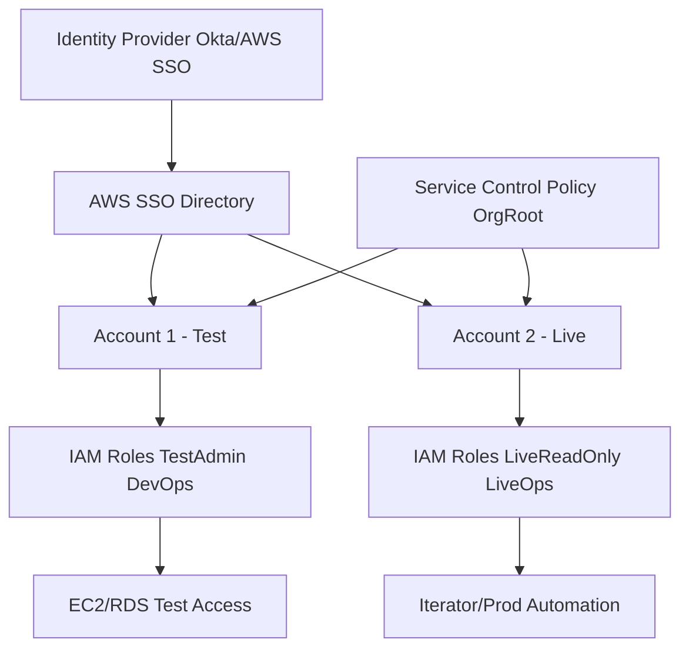

# 🔑 Day 8 – Identity & Access Hardening (SSO / IAM Boundaries / Cross-Account Access)

## 🎯 Objective
Centralize and harden identity management across environments.  
Implement AWS SSO (Single Sign-On), enforce least-privilege IAM roles, apply service control policies (SCPs), and enable cross-account secure delegation.

---

## 🧱 1. Architecture Blueprint

## 🧭 2. Enable AWS SSO and SCIM Integration

In AWS Organizations: Enable AWS Single Sign-On.

Connect SSO to your IdP (e.g., Okta, Azure AD).

Provision users/groups via SCIM:

aws sso-admin create-account-assignment \
  --instance-arn <instance> \
  --target-id <account-id> \
  --target-type AWS_ACCOUNT \
  --permission-set-arn <permission-set-arn> \
  --principal-type GROUP \
  --principal-id <group-id>
## 🧰 3. Terraform IAM Roles and Boundaries

Create ~/secure-network-course/terraform/iam.tf:

resource "aws_iam_policy" "boundary" {
  name = "global-boundary"
  policy = jsonencode({
    Version = "2012-10-17",
    Statement = [
      { Effect = "Allow", Action = "*", Resource = "*" },
      { Effect = "Deny", Action = "ec2:TerminateInstances", Resource = "*" },
      { Effect = "Deny", Action = "iam:DeleteUser", Resource = "*" }
    ]
  })
}

resource "aws_iam_role" "app_role" {
  name = "${var.env_name}-app-role"
  assume_role_policy = jsonencode({
    Version = "2012-10-17",
    Statement = [
      { Effect = "Allow", Principal = { Service = "ec2.amazonaws.com" }, Action = "sts:AssumeRole" }
    ]
  })
  permissions_boundary = aws_iam_policy.boundary.arn
}

## 🔄 4. Cross-Account Access (Assume Role)

Test Account:

resource "aws_iam_role" "cross_test_role" {
  name = "CrossToLiveRole"
  assume_role_policy = jsonencode({
    Version = "2012-10-17",
    Statement = [
      { Effect = "Allow", Principal = { AWS = "<live-account-id>" }, Action = "sts:AssumeRole" }
    ]
  })
}
In Live Account:

data "aws_caller_identity" "current" {}
output "test_cross_account_arn" { value = aws_iam_role.cross_test_role.arn }
From Live:

aws sts assume-role --role-arn <test-cross-account-arn> --role-session-name LiveToTestAccess

## 🧩 5. Service Control Policies (SCP)

Examples applied at Org root:

Deny Public S3 Buckets

json
Copy code
{
  "Version": "2012-10-17",
  "Statement": [
    { "Effect": "Deny", "Action": "s3:PutBucketAcl", "Resource": "*",
      "Condition": { "StringEquals": { "s3:x-amz-acl": "public-read" }} }
  ]
}
Enforce MFA

json
Copy code
{
  "Version": "2012-10-17",
  "Statement": [
    { "Effect": "Deny", "Action": "*", "Resource": "*",
      "Condition": { "BoolIfExists": { "aws:MultiFactorAuthPresent": "false" }} }
  ]
}
Apply:

aws organizations create-policy --name EnforceMFA --type SERVICE_CONTROL_POLICY --content file://mfa.json
aws organizations attach-policy --target-id <org-root-id> --policy-id <policy-id>

## 📜 6. Auditing and Monitoring

CloudTrail: monitor AssumeRole, CreateUser, AttachRolePolicy.

AWS Config rule: iam-user-mfa-enabled.

Security Hub: CIS Section 1 compliance.

EventBridge + Lambda: auto-detach if non-MFA login detected.

## 🛡️ 7. Checklist

Control	Status	Evidence
SSO Enabled	✅	IdP connected
Permissions Boundaries	✅	IAM role contains boundary ARN
MFA Required	✅	SCP Enforce MFA
Cross-Account Access Controlled	✅	AssumeRole tested
SCPs Applied	✅	AWS Organizations view

## 🧠 8. Deep Reasoning – “The Least Privilege Pyramid”

Human access via SSO only.

Automation via scoped roles.

Every action tied to a session ID + CloudTrail log.

Permission boundaries prevent privilege creep.

SCPs protect against account-level misconfigurations.

## 🧾 Day 8 Summary

✅ AWS SSO and MFA enforced
✅ IAM Boundaries and SCPs configured
✅ Cross-account access delegated securely
✅ Auditing and automation in place
✅ Identity plane now Zero-Trust compliant

## 🔖 Next

Day 9 – Incident Response & Forensics (Detective, Athena, Response Automation)
